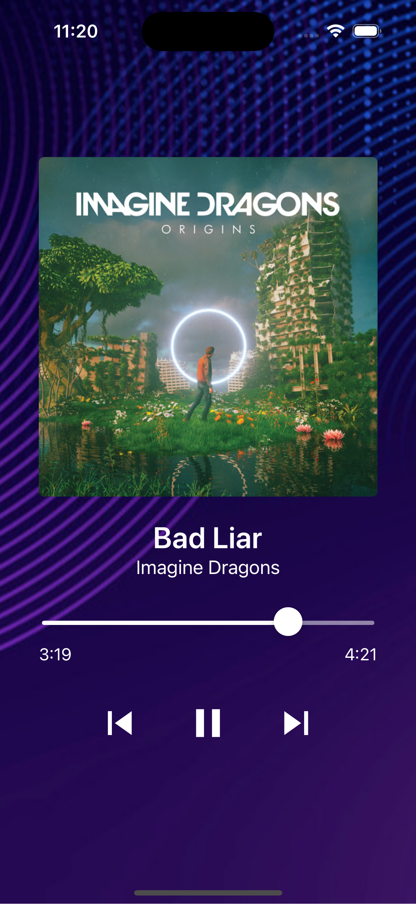

# Music Mayhem 🎧

Welcome to the Music Mayhem, a sleek and intuitive application designed to enhance your music listening experience on both Android and iOS platforms.

# Features 🔥

💁‍♂️ Play, Pause, and Navigate: Effortlessly control your music playback with the touch of a button. Play your favorite tracks, pause to savor the moment, and easily navigate through other musics.

💁‍♂️ Next and Previous Track: Seamlessly move between tracks with the next and previous buttons. Whether you're in the mood for the next hit or want to revisit a favorite, the app has you covered.

## Getting Started 🚀

First, you will need to install **Node Modules**, which contains the dependencies (libraries) that your project relies on.

To Install **Node Modules**, run the following command from the _root_ of your React Native project:

```bash
# using npm
npm install

# OR using Yarn
yarn install
```

Following the successful installation of **Node Modules**, the next step involves installing **pods** for iOS.

```bash
cd ios && pod install
```

## Start your Application ⚡

Let Metro Bundler run in its _own_ terminal. Open a _new_ terminal from the _root_ of your React Native project. Run the following command to start your _Android_ or _iOS_ app:

### Running the Android app 🤖

```bash
# using npm
npm run android

# OR using Yarn
yarn android
```

### Running the iOS app 📱

```bash
# using npm
npm run ios

# OR using Yarn
yarn ios
```

If everything is set up _correctly_, you should see your new app running in your _Android Emulator_ or _iOS Simulator_.

This is one way to run your app — you can also run it directly from within Android Studio and Xcode respectively.

## Congratulations! 🎉

You've successfully run your **Music Mayhem** App. 🥳

### Let's See Preview 🙈

|  |  |
| :-----------------------------: | :-----------------------------: |

# Troubleshooting

If you can't get this to work, see the [Troubleshooting](https://reactnative.dev/docs/troubleshooting) page.

# Learn More

To learn more about React Native, take a look at the following resources:

- [React Native Website](https://reactnative.dev) - learn more about React Native.
- [Getting Started](https://reactnative.dev/docs/environment-setup) - an **overview** of React Native and how setup your environment.
- [Learn the Basics](https://reactnative.dev/docs/getting-started) - a **guided tour** of the React Native **basics**.
- [Blog](https://reactnative.dev/blog) - read the latest official React Native **Blog** posts.
- [`@facebook/react-native`](https://github.com/facebook/react-native) - the Open Source; GitHub **repository** for React Native.

## Authors

- [@NirmalsinhRathod](https://github.com/NirmalsinhRathod)


